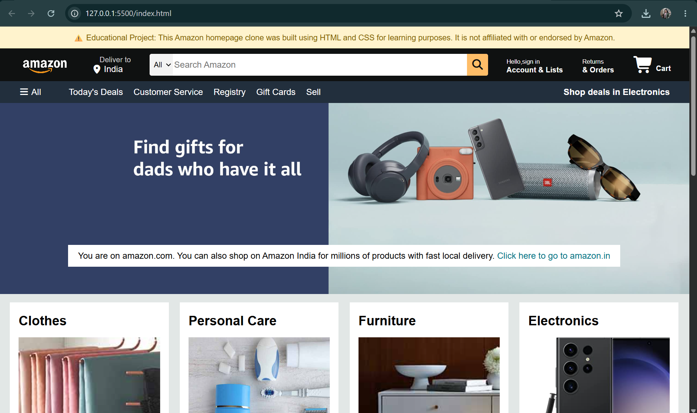
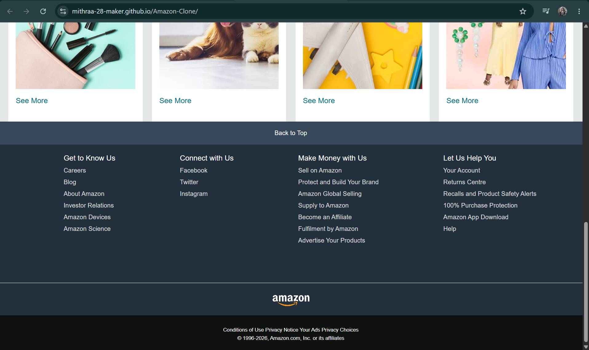

# 🛒 Amazon Clone

A responsive Amazon homepage clone built using **HTML5** and **CSS3**. This project recreates the layout and design of Amazon's homepage to practice frontend web development and improve CSS Flexbox skills.

##  Live Demo

🔗  https://mithraa-28-maker.github.io/Amazon-Clone/

---

## 📸 Preview




---

## Features

- 🛍️ Amazon-inspired homepage design
- 🔍 Search bar with category dropdown
- 📍 Delivery location section
- 👤 Sign In & Account section
- 🛒 Shopping cart icon
- 📢 Navigation panel
- 🖼️ Hero banner
- 📦 Product cards
- 📱 Clean and responsive layout using Flexbox

---

## Technologies Used

- HTML5
- CSS3
- Font Awesome

---

## 📂 Folder Structure

```
Amazon-Clone/
│── index.html
│── style.css
│── README.md
│── amazon_logo.png
│── hero_image.jpg
│── box1_image.jpg
│── ...
```

---

##  What I Learned

Through this project, I learned:

- Structuring web pages using HTML
- Styling websites with CSS
- Using Flexbox for layouts
- Working with images and background properties
- Building responsive webpage sections
- Using Font Awesome icons
- Uploading projects using Git & GitHub
- Deploying websites with GitHub Pages

---

## Future Improvements

- Make the website fully responsive for mobile devices
- Add JavaScript functionality
- Create working search functionality
- Add dropdown menus
- Build Login and Cart pages
- Improve accessibility and animations

---

## Author

**Mithraa Nandakumar**

GitHub: https://github.com/Mithraa-28-maker
